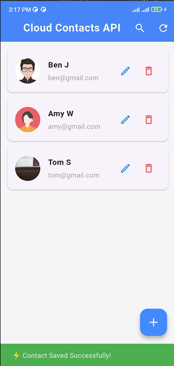
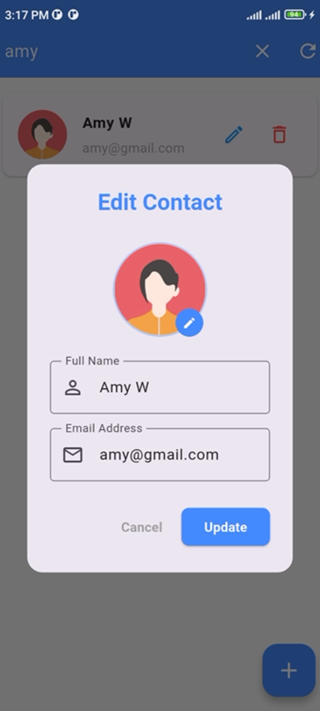
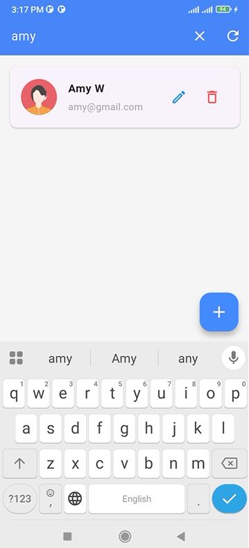
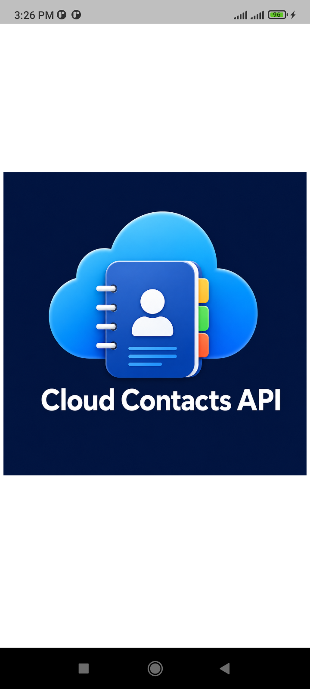

# 📂 Cloud Contacts API
> A Production-Ready Offline-First Contact Management System Built with Flutter.


---

## 📸 Application Preview


| 🏠 Contact Dashboard | 📝 Profile Editor |
| :---: | :---: |
|  |  |

| 🔍 Real-time Search Filter | 🎨 Branded Splash Screen |
| :---: | :---: |
|  |  |
---


## 🎯 Project Overview
**Cloud Contacts API** is an application built on a core **Offline-First Architecture**. The application operates independently of active network availability; users can smoothly Create, Read, Update, and Delete (CRUD) contacts in offline mode. A background synchronization engine monitors network connectivity and executes an automatic bidirectional sync as soon as the internet connection is restored.

### 💎 Key Architectural Values & Features
* **Single Source of Truth:** The UI reads reactive stream data exclusively from the local SQLite cache (`contacts.db`), eliminating asynchronous screen flickering during layout rendering.
* **🎨 Seamless Native Splash Screen:** Features an integrated full-bleed branding welcome screen that completely handles native cold start overheads and renders edge-to-edge across all screen sizes.
* **⚡ Real-Time Search Filter:** Includes a high-performance search algorithm that offers instantaneous contact matching from the local database, allowing users to find contacts effortlessly.
* **📦 Native App Icon Launcher Integration:** Integrated with responsive native launcher icons optimized to fit the precise grid and display standards of Android, iOS, and Windows platforms.
* **Smart Binary Compression:** Compresses avatar images selected via the native image picker by up to 80% at runtime (`512x512` frame size), converting them into lightweight Base64 layers to prevent local cache lagging and remote server overloads.
* **State Preservation:** Retains pipeline entries locally within the sync engine during network failures rather than dumping or losing transient state data.

---

## ⚙️ Data Synchronization Engine

The application monitors and traces local modifications using a database-level **Sync State Machine**:


| Local Status Flag | Description / Operational Behavior | Target HTTP Verb |
| :--- | :--- | :--- |
| `SYNCED` | Data is perfectly unified across local storage and the MockAPI server. | *None* |
| `PENDING_INSERT` | Contact created while offline. Stored locally, waiting for connection. | `POST` |
| `PENDING_UPDATE` | Existing contact modified while offline. Updates queued locally. | `PUT` |
| `PENDING_DELETE` | Contact soft-deleted by user. Kept in cache until remote drop completes. | `DELETE` |

```text
  [ User Action ] 
         │
         ▼
 ┌───────────────┐
 │ Local SQLite  │ ◄─── (UI reads directly from here instantly)
 └───────┬───────┘
         │
         │ Connectivity Listener Checks Network
         ▼
   { Internet? } ─────── ( No ) ───────► [ Keep Flag / Wait For Boot ]
         │
       ( Yes )
         │
         ▼
 ┌───────────────┐
 │ Cloud MockAPI │ ───► Endpoint: https://mockapi.io
 └───────────────┘
```

---

## 📁 Repository Directory Structure

```text
lib/
├── database_helper/
│   └── database_helper.dart      # SQLite Storage Base & Silent Sync Engine Core
├── models/
│   └── user_model.dart           # Unified data schema with internal sync tracing
├── screens/
│   ├── splash_screen.dart        # Full-size native-scaled application welcome layout
│   ├── add_user_screen.dart      # Isolated cache submission view (with optimized 512px BoxFit cropping)
│   ├── edit_user_screen.dart     # Safe mapping local state update manager (Camera/Gallery native switcher)
│   └── user_list_screen.dart     # Reactive contact dashboard component with Search Filter
└── services/
    └── api_service.dart          # HTTP client layer implementing standard REST methods
```

---

## 🚀 Installation & Build Guide

### Prerequisites
* Flutter SDK Setup (`^3.11.0` or later stable channel)
* System configured environment flags for Android SDK, iOS Xcode, or Windows C++ build tools.

### Step-by-Step Deployment

1. Clone the project repository from your shell:
   ```bash
   git clone https://github.com
   cd cloud_contacts_api
   ```

2. Fetch complete application package ecosystem dependencies:
   ```bash
   flutter pub get
   ```

3. **[Mandatory]** Generate or regenerate launcher icons and asset mappings natively for all platforms:
   ```bash
   dart run flutter_launcher_icons
   ```

4. Execute a thorough system workspace wipe to purge binary metadata overlaps:
   ```bash
   flutter clean
   flutter pub get
   ```

5. Compile and spin up the debugging runner on your current active workstation target:
   ```bash
   flutter run
   ```

---

## 🛠️ Technology Stack & Core Packages
* **Core Framework:** Dart / Flutter SDK
* **Database Layer:** `sqflite` (SQLite core transitional architecture)
* **Storage Paths:** `path` (Virtual file routing wrapper)
* **Network Handshaking:** `http` (Thread-safe HTTP network protocols interface)
* **Connectivity Monitor:** `connectivity_plus` (Broadcast stream watcher for environment states)
* **Media Handling:** `image_picker` (Native photo capture and compression pipe)
* **Assets & Styling:** `flutter_launcher_icons` (Automated multi-platform native asset icon injector)

---

## 👤 Developer Profile
This architecture was designed and maintained with standard software engineering principles by:

* **GitHub:** [@jahngeer](https://github.com)
* **Project Name:** Cloud Contacts API
---
